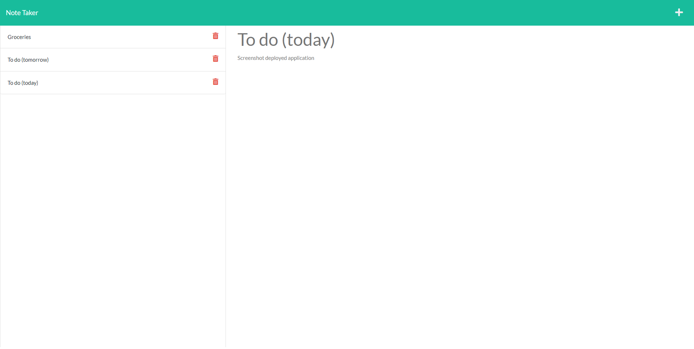

# Note-Taker
## Description
The files found with this README file come together to create a note taking application! The front end code was given.

## server.js
I created the server.js file from scratch. I:
- imported all of my packages
- set the PORT to that of heroku
- initialized my app variable by equaling it to express()
- set up my middleware to read my incoming data
- created variables for my fs related methods
- created routes for the html files
- created routes that enabled the inputting of, appending of, and deletion of notes
- added a message for if my server loaded

## Screenshot:
Here is a screenshot of the deployed application:

## Link to Deployed Application:
This is the link to my deployed application via Heroku (and GitHub technically):

<a href="https://note-taker-app-22.herokuapp.com/">https://note-taker-app-22.herokuapp.com/</a>